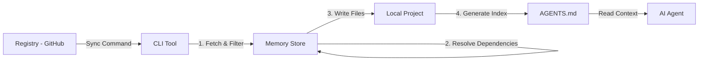

# Architecture & Design Records

This document captures the high-level design, data flow, and key decision records for the `full-stack-skill` CLI.

## 1. System Overview

The system consists of three main components:

1.  **Registry**: A Git repository containing skill definitions organized by type:
    - `skills/` — coding skills by framework/language
    - `rules/` — global agent behavior rules
    - `workflows/` — reusable workflow runbooks
    - `hooks/` — IDE session hooks
    - `tests/` — automated testing scripts for skills
2.  **CLI**: The `@truongnq-ai/full-stack-skill` npm package that fetches, validates, and syncs content to a project.
3.  **Local Project**: The user's codebase where content is installed (e.g., `.agent/skills/`, `.agent/rules/`, `.agent/workflows/`).

### Data Flow

## 2. Core Services

### SyncService (`cli/src/services/SyncService.ts`)

The brain of the operation. Orchestrates the synchronization process.

- **Responsibility**: Fetching, filtering/excluding, writing files, and triggering index generation.
- **Key Dependency**: `IndexGeneratorService`.
- **Design Principle**: "Safe Overwrite" — respects `custom_overrides` in `.skillsrc`.

### IndexGeneratorService (`cli/src/services/IndexGeneratorService.ts`)

Creates the "Context Bridge" for AI agents.

- **Input**: A directory of installed skills.
- **Output**: A compressed, token-optimized index (Markdown).
- **Injection**: Looks for `<!-- AGENT_SKILLS_START -->` markers in `AGENTS.md`.

### ConfigService (`cli/src/services/ConfigService.ts`)

Manages user configuration (`.skillsrc`).

- **Responsibility**: Parsing YAML, validating schema (Zod), resolving dependency exclusions.

### DetectionService (`cli/src/services/DetectionService.ts`)

Auto-detects frameworks and languages in the user's project.

- **Scans**: `package.json`, `pubspec.yaml`, `go.mod`, `pom.xml`, `build.gradle`, etc.
- **Output**: Map of detected frameworks and AI agents.

## 3. Token Economy (Design Constraint)

This is a **High-Density** project. Every feature is evaluated against its impact on the AI's context window.

- **Skill Files**: Must be < 500 tokens.
- **Index**: Must be < 200 tokens per 10 skills.
- **References**: Heavy content goes to `references/` folder, loaded only on demand.

## 4. Decision Records

### ADR-001: Local-First Indexing

_Date: 2026-03-01_
**Decision**: `SyncService` generates the index by scanning the _local_ disk after writing files, rather than using the in-memory list.
**Reason**: Ensures manual edits and custom local skills are included in the index.

### ADR-002: Decoupled Versioning

_Date: 2026-03-01_
**Decision**: CLI and skills are versioned independently. CLI uses date-based versioning (`YYYY.MM.DD`), skills use semantic versioning per category.
**Reason**: Allows skill updates without forcing CLI upgrades and vice versa.
