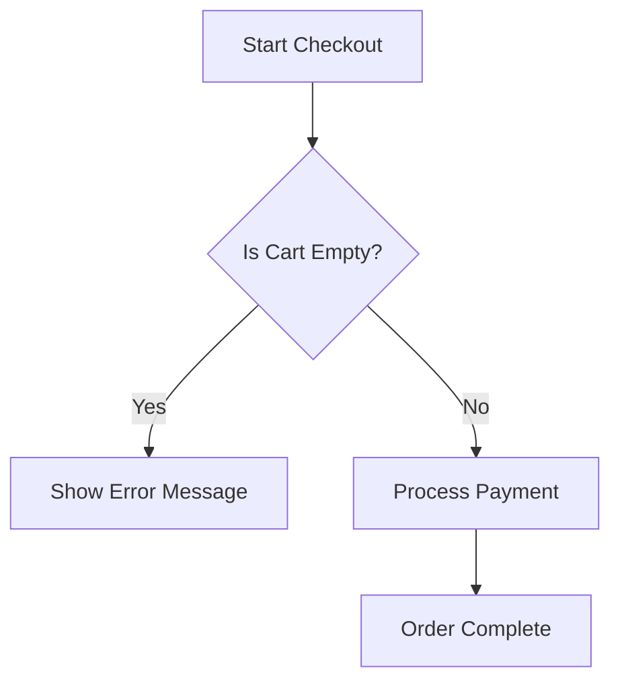
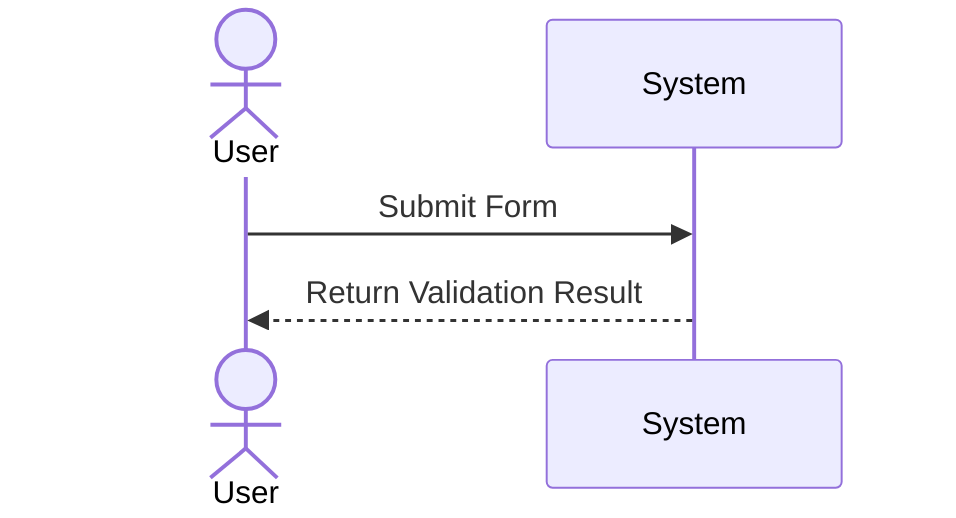

# 📐 Structured System Modeling

> **Use this skill when**: a BA needs to visually map out a complex business process, state machine, or data entity relationship to ensure stakeholders and devs understand the flow. Trigger: `/ba-model-system`.
>
> **Out of scope**: This is NOT for deep infrastructure/C4 component architecture (use Architecture/Dev skills). This focuses purely on Business Logic and Domain flows.

---

## 🚫 Anti-Patterns

- **Syntax Errors**: Writing Mermaid code with unescaped HTML characters (`<`, `>`), unquoted parentheses in node names, leading to rendering crashes.
- **Spaghetti Diagrams**: Creating one massive flow chart with 50 nodes instead of breaking it down into `Login Flow`, `Checkout Flow`, etc.
- **Missing Legends**: Using weird shapes or colors without defining what a hexagon or cylinder means in the business context.
- **Orphan Modles**: Generating a diagram without attaching it or embedding it inside its parent User Story (US-XXX).

---

## 🛠 Prerequisites & Tooling

1. Markdown editor capable of rendering ````mermaid```` blocks (standard GitHub Flavored Markdown).
2. Deep understanding of `docs/GLOSSARY.md` to ensure nodes use precise terminology.

---

## 🔄 Execution Workflow

### Step 1 — Select Model Type
Parse the business requirement and choose the best visual tool:
- **Process / Decision Trees** → Mermaid `flowchart TD`
- **API / Cross-system interaction** → Mermaid `sequenceDiagram`
- **Data Entities** → Mermaid `erDiagram`
- **Object Lifecycle (e.g., Order Status)** → Mermaid `stateDiagram-v2`

### Step 2 — Draft the Nodes & Edges
Extract the Actors, Actions, and Conditions from the text.
*Safety Rule*: Always wrap node texts with quotes or brackets properly to avoid Mermaid parse crashes. 
*Bad*: `A[User logs in (via SSO)]`
*Good*: `A["User logs in (via SSO)"]`

### Step 3 — Generate Mermaid Block
Create the diagram block with strict formatting.

*Example Flowchart*:


*Example Sequence*:


### Step 4 — Embed in Documentation
Inject the `mermaid` block directly into the relevant `docs/specs/US-xxx.md`.
Always precede the diagram with a **1-2 sentence human-readable summary** explaining what the diagram represents.

---

## ⚠️ Error Handling (Fallback)

| Error | Detection | Fallback Action |
|-------|-----------|-----------------|
| Parse Crash | Mermaid fails to render in UI | Immediately review syntax. Ensure strict usage of straight quotes `" "`. Remove any ampersands `&` or brackets `[]` inside unquoted node names. |
| Overly Complex | Agent times out generating or logic loops | Break the diagram into `Main Flow` entirely, and abstract edge cases into a `Sub-Flow` diagram. |
| Concept Mismatch| BA creates ERD for a process | Re-evaluate Step 1. Swap `erDiagram` for `flowchart TD` to map actions. |

---

## ✅ Done Criteria / Verification

- [ ] Mermaid syntax uses valid v9/v10 keywords (`flowchart`, `sequenceDiagram`, `stateDiagram-v2`).
- [ ] All complex strings inside nodes are safely wrapped in quotes.
- [ ] Diagram explicitly maps 1:1 with the text-based Acceptance Criteria of the User Story.
- [ ] Diagram is saved or appended to the target specification markdown file.
