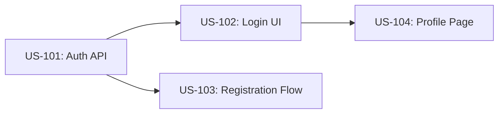

# 🗺️ Product Owner — Plan Feature

> **Use this skill when**: PO needs to take a feature idea from concept to a development-ready plan — including scope definition, story breakdown, dependency mapping, and sprint assignment.
>
> **Out of scope**: Writing the full PRD from scratch (use `po/prd-generation` or `po/feature-discovery`). Actual sprint execution (use `po/backlog-management`). Technical architecture decisions (use `dev/architecture-decision-records`).

---

## **Priority: P0 (CRITICAL)**

## Output (Strict)

```yaml
summary: "<what was done>"
risks: ["<risk 1>"] # or []
next_checks: ["<check 1>"]
```

---

## 🔄 Workflow

### Step 1 — Discovery Interview
Conduct a structured interview with the stakeholder:

1. **Problem Statement**: "What problem are we solving? For whom?"
2. **Business Value**: "How does this impact revenue, retention, or user satisfaction?"
3. **Constraints**: "What are the technical, time, or budget constraints?"
4. **Success Criteria**: "How will we know this feature is successful?"

> **⏸️ Checkpoint**:
> "I have gathered the feature context. Here is my understanding. Is this accurate? (Y/N)"

### Step 2 — Scope Definition (MoSCoW)
Classify feature components using MoSCoW:

| Component | MoSCoW | Rationale |
|-----------|--------|-----------|
| Core user flow | Must | Required for MVP |
| Admin dashboard | Should | Important but deferrable |
| Email notifications | Could | Enhancement |
| Multi-language support | Won't (this release) | Future scope |

### Step 3 — Story Breakdown
Break the "Must" and "Should" scope into user stories:

1. Each story follows: `As a [role], I want [action] so that [benefit]`.
2. Each story has ≥2 acceptance criteria in Given/When/Then format.
3. Each story is estimated (S/M/L) and assigned a priority (P0/P1/P2).

### Step 4 — Dependency & Risk Mapping
Create a dependency graph:
- Identify upstream dependencies (API, infrastructure, 3rd-party).
- Identify downstream impacts (other features, teams, releases).
- Document ≥2 risks with mitigation plans.



### Step 5 — Sprint Assignment & Readiness
- Assign stories to target sprints based on capacity and dependencies.
- Ensure all P0 stories pass Definition of Ready (DoR):
  - [ ] Acceptance criteria defined
  - [ ] Dependencies identified and unblocked
  - [ ] Design mockups linked (if UI-facing)
  - [ ] Effort estimated

### Step 6 — Output Feature Plan
Write `docs/feature-plans/feature-[name].md` containing:
- Problem statement, scope table, stories, dependency graph, sprint assignment, risks.

---

## 🚫 Anti-Patterns
- **Feature Factory**: Planning features without connecting them to a measurable business outcome. Every feature must have a "why".
- **Big Bang Scoping**: Trying to plan everything for a 6-month feature in one session. Plan in increments of 2-4 weeks.
- **Skipping Discovery**: Jumping straight to story writing without understanding the problem space leads to rework.
- **Gold Plating**: Including "nice-to-have" items in the MVP scope. Stick to MoSCoW "Must" for v1.
- **No Exit Criteria**: Planning without defining when the feature is "done" and what success looks like.

---

## 🛠️ Tools
- Jira, Linear, Azure DevOps (story tracking)
- Miro, FigJam (discovery workshops and dependency mapping)
- Mermaid (in-document dependency graphs)
- Notion, Confluence (feature plan documentation)
- `view_file`, `write_to_file`, `search_web` (for research and file-based plans)

---

## ⚠️ Error Handling

| Issue | Cause | Fallback Action |
|-------|-------|-----------------|
| Stakeholder unavailable | Cannot conduct discovery | Document assumptions explicitly, mark as "Pending Validation", schedule follow-up |
| Conflicting requirements | Multiple stakeholders disagree | Escalate to PO lead; document both perspectives and trade-offs |
| No existing PRD | Feature is net-new | Invoke `po/prd-generation` skill first before planning |
| Unclear technical feasibility | Engineering hasn't assessed | Create a Spike story (time-boxed investigation) before committing scope |

---

## ✅ Verification
- [ ] Problem statement is documented and validated with stakeholder.
- [ ] Scope is classified using MoSCoW.
- [ ] All "Must" items have user stories with acceptance criteria.
- [ ] Dependency graph is created and reviewed.
- [ ] ≥2 risks are documented with mitigation plans.
- [ ] Feature plan artifact is saved and committed.

---

## 📚 References
- [Shape Up — Basecamp](https://basecamp.com/shapeup)
- [MoSCoW Prioritisation](https://www.productplan.com/glossary/moscow-prioritization/)
- [User Story Mapping — Jeff Patton](https://www.jpattonassociates.com/user-story-mapping/)
- [Definition of Ready — Scrum.org](https://www.scrum.org/resources/blog/walking-through-definition-ready)
